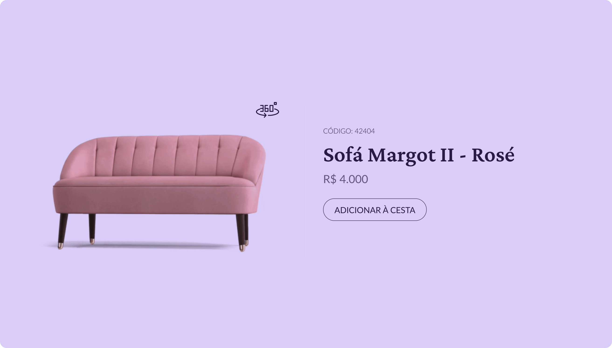

<h2 align="center">🎵 Desafio Card Produto</h2>

    

<h3>💻 Descrição do projeto</h3>

Para o segundo desafio, foi criado uma página web em HTML, CSS e, desta vez, Javascript, para a função. O desafio pedia que fosse mostrado, ao clicar no botão de 360º, um gif do sofá, e, ao clicar no botão de fechar, a imagem voltasse para a estática.Para melhor visualização do [layout do desafio.](https://www.figma.com/community/file/1195050984449538256)

<h3>📚 Aprendizagem</h3>

- Atributo defer.
- DOM.
- Propriedades de instância (documentElement).
- Função toggle().

<h3>📝 Status do projeto</h3>

Concluído

    <footer>Feito com 🧡 por Lucas Moraes</footer>

