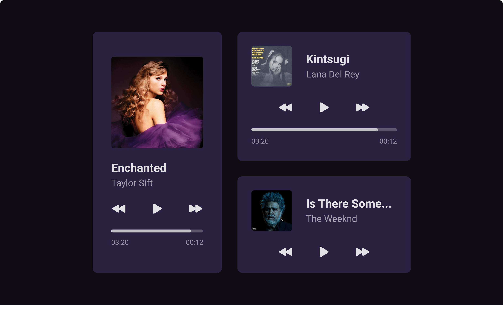

<h2 align="center">Desafio Music Player</h2>

    

<h3>💻 Descrição do projeto</h3>

Para o desafio 1, como solicitado, foi desenvolvido, com HTML e CSS, um Music Player, conforme o [layout do desafio.](https://www.figma.com/file/XnielIsj9qrix1qxAQLT9X/23boraCodar-Desafio-1/duplicate)

<h3>📚 Aprendizagem</h3>

- Tag semântica <aside>
- Pseudo-elementos ::before e ::after
- Seleção direta de um elemento (>)
- Pseudo-classe :root
- Reprodução do layout do Figma

<h3>Status do projeto</h3>

✅ Concluído

<footer align="center">Feito com 🧡 por Lucas Moraes</footer>